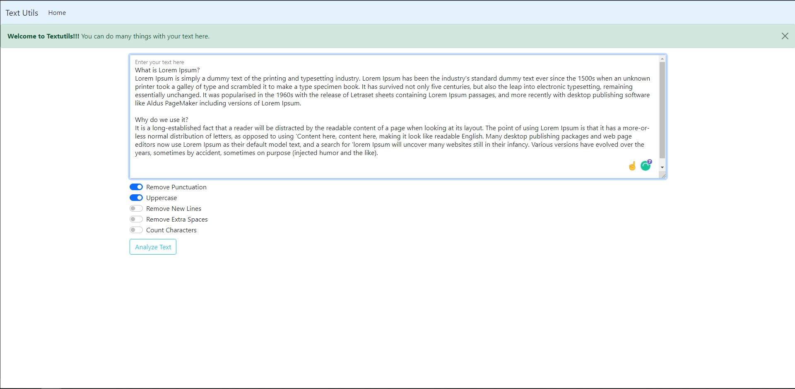
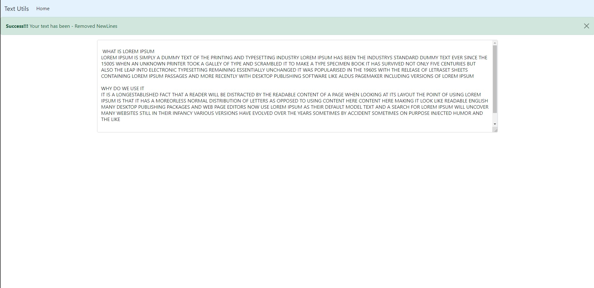
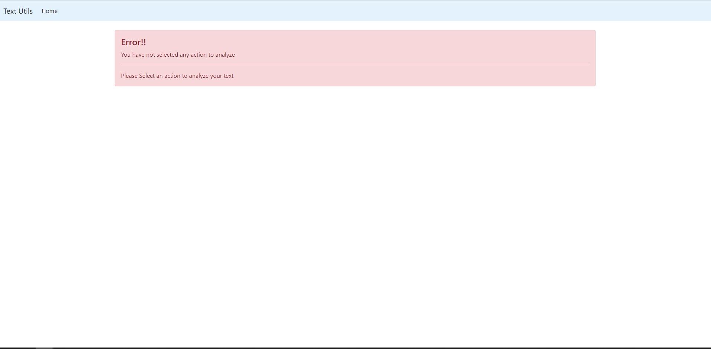

# Dajngo Text Analyzer Project


This is a Django Text Analyzer Project Based on Django in backend and Bootstrep in frontend. The project aims to help the user to paste his paragraph/ text and 
analyze it. 

## What can we do from textutils?


1)Remove Punctuations<br/>
2)UPPERCASE<br/>
3)New Line Remove<br/>
4)Extra Spaces Remover<br/>
5)Count Characters<br/>


## Home Page
In this page the user will paste his text and chose analyzer option.



## Analyzer Page
The text will be shown here after analyzer


## Error Page
The user will see error if he does not choose any analyze option and will be redirected to this page



## Requirements
Python3 <br/>
django

# How to run this project?
Downlod/Pull the entire folder, download all the dependencies, install django
Then go to cmd and run

```
python manage.py runserver
```


